# 프로젝트 목표

AWS 프리티어 계정으로 과금 없이 웹 서비스 제공 환경을 구성하는 것을 목표로 한다.  
이 프로젝트에서는 React 를 사용한 SPA(Single Page App)과 Spring Boot 를 사용한 백엔드 API 서버를 사용한다고 가정한다.

# AWS 시스템 구성도

## 프론트엔드 구성도

### 정적 웹사이트 구성도

`클라이언트`가 루트 경로(`/`), 루트 경로의 정적파일(`/*.*`), 정적 파일 경로(`/static/*`)로 GET 요청을 한 경우,  
아래와 같은 순서로 정적 파일을 제공한다.

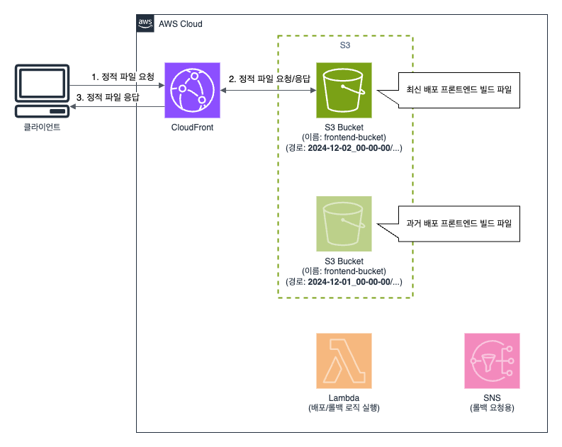

예시: `클라이언트`가 루트 경로(`/`)로 GET 요청

1. `클라이언트`가 `CloudFront`에게 루트 경로(`/`)로 GET 요청을 한다.
2. (조건부 실행) `CloudFront`는 캐시 스토리지에 `index.html` 파일이 없으면, `S3 Bucket`에게 `index.html` 파일을 요청하고 응답받는다.
3. `CloudFront`는 `클라이언트`에게 `index.html` 파일을 응답한다.

### [예외처리] 정적 웹사이트 구성도

`클라이언트`가 직접 URL 을 입력해서 GET 요청을 한 경우, 아래와 같은 순서로 정적 파일을 제공한다.

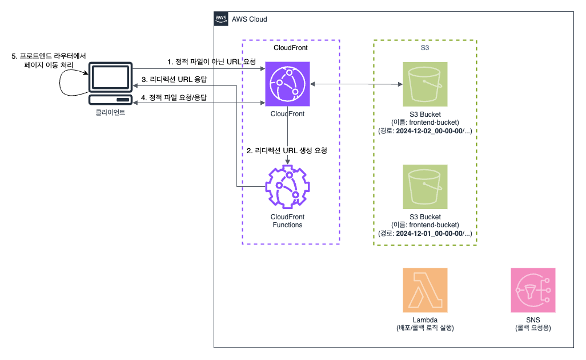

예시: `클라이언트`가 특정 경로(`/products/1234?filters=1&filters=2`)로 GET 요청

1. `클라이언트`가 `CloudFront`에게 특정 경로(`/products/1234?filters=1&filters=2`)로 GET 요청을 한다.
2. `CloudFront`는 `CloudFront Functions`에게 '리디렉션 URL' 생성 요청을 한다.
3. `CloudFront Functions`는 아래 포맷으로 '리디렉션 URL'을 생성하고 `클라이언트`에게 302 상태 값으로 응답한다.
    - 리디렉션 URL 포맷: 루트 경로 + redirect_path 쿼리스트링
    - 리디렉션 URL 예시: `/?redirect_path={Base64 인코딩("/products/1234?filters=1&filters=2")}`
4. `클라이언트`는 `CloudFront`에게 '리디렉션 URL' 으로 GET 요청을 하고 `index.html` 파일을 응답받는다.
5. `클라이언트`의 프론트엔드 라우터에서 redirect_path 쿼리스트링 값으로 페이지 이동처리를 한다.

### 배포 구성도

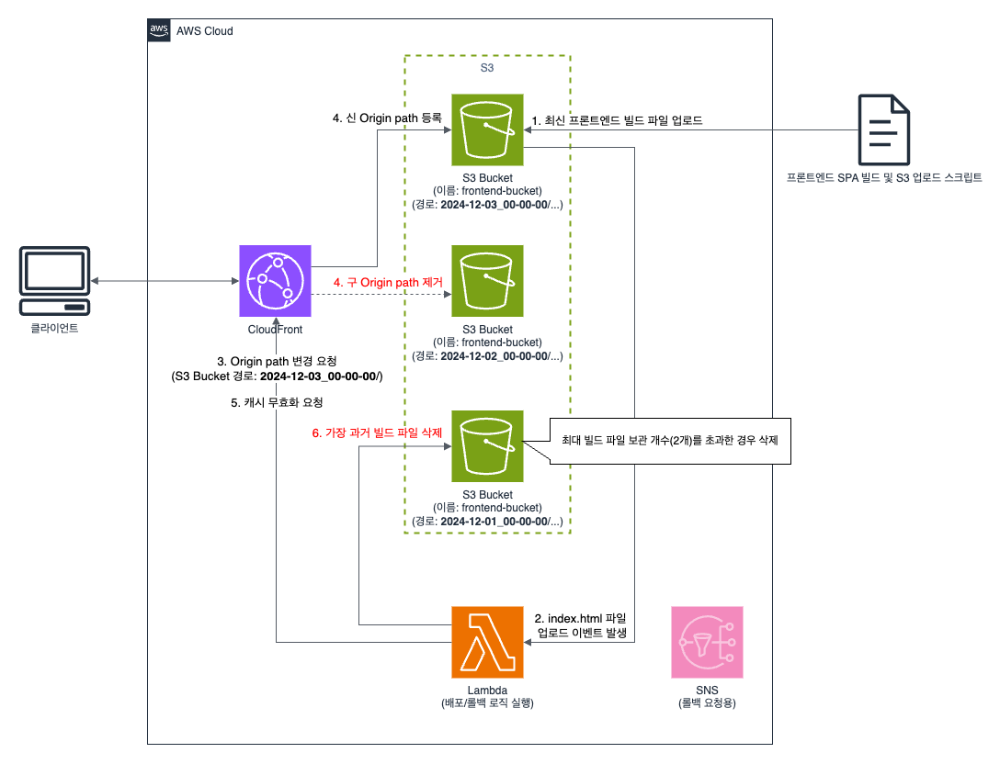

예시: 폴더 이름이 `2024-12-03_00-00-00`인 프론트엔드 빌드 파일 배포

1. `S3 Bucket`으로 폴더명이 `2024-12-03_00-00-00`인 프론트엔드 빌드 파일을 업로드 한다.
2. `S3 Bucket`의 이벤트 알림이 `index.html` 객체 생성 이벤트를 감지하고, 프론트엔드 배포 `Lambda` 함수를 호출한다.
3. `Lambda` 함수는 `CloudFront`의 Origin path 를 `2024-12-03_00-00-00`(신버전)으로 업데이트 요청을 한다.
4. `CloudFront` 의 Origin path 가 `2024-12-02_00-00-00`(구버전)에서 `2024-12-03_00-00-00`(신버전)으로 업데이트 된다.
5. `Lambda` 함수는 `CloudFront`의 캐시 무효화를 전체 경로(`/*`)로 요청 한다.
6. (조건부 실행) 프론트엔드 빌드 최대 보관 개수가 초과한 경우, `Lambda` 함수는 `S3 Bucket` 의 `2024-12-01_00-00-00`(가장 구버전)를 삭제한다.

### 롤벡 구성도

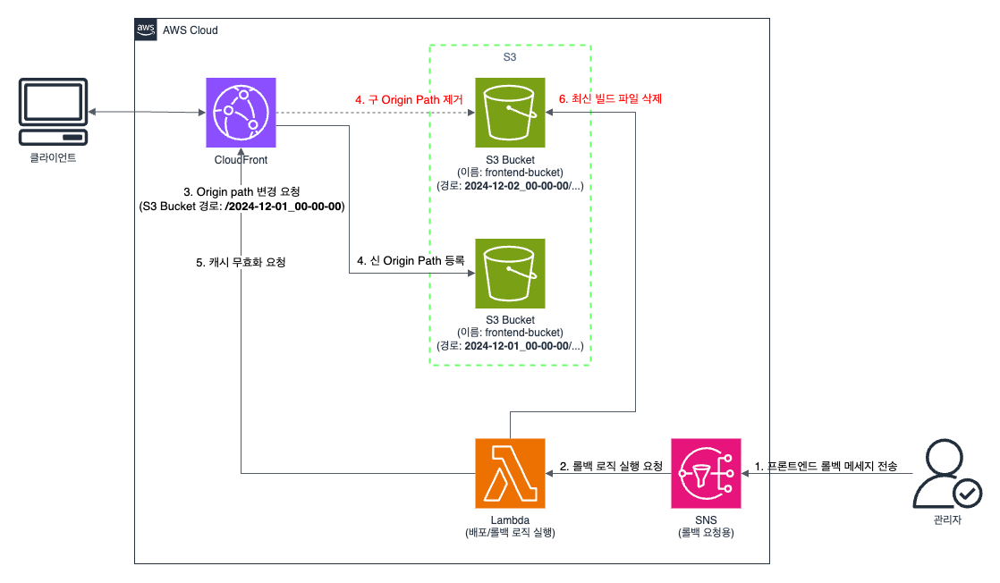

예시: 폴더 이름이 `2024-12-02_00-00-00` 인 프론트엔드 빌드 파일 롤벡

1. `관리자`는 `SNS`(Simple Notification Service)로 프론트엔드 롤벡 메세지를 전송한다.
2. `SNS` 토픽은 프론트엔드 롤벡 `Lambda` 함수를 호출한다.
3. `Lambda` 함수는 `CloudFront`의 Origin path 를 `2024-12-01_00-00-00`(구버전)으로 업데이트 요청을 한다.
4. `CloudFront` 의 Origin path 가 `2024-12-02_00-00-00`(신버전)에서 `2024-12-01_00-00-00`(구버전)으로 업데이트 된다.
5. `Lambda` 함수는 `CloudFront`의 캐시 무효화를 전체 경로(`/*`)로 요청 한다.
6. `Lambda` 함수는 `S3 Bucket`의 `2024-12-02_00-00-00`(신버전)를 삭제한다.

## 백엔드 구성도

### API 서버 구성도

실행 순서가 중요한 구성도가 아니므로 영문 알파벳으로 표기한다.

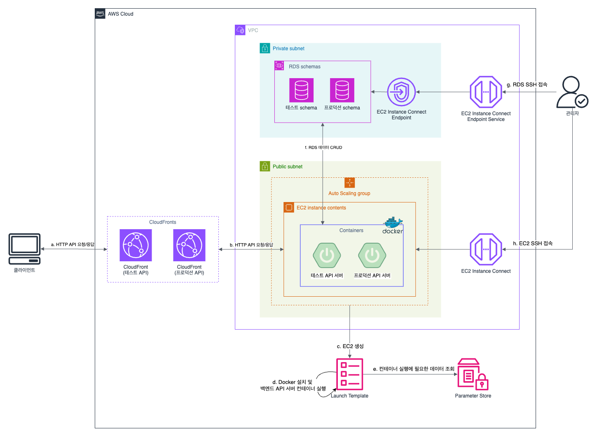

- (A) `클라이언트`는 `CloudFront`에게 HTTP API 를 요청하고 응답받는다.
- (B) `CloudFront`는 `EC2 인스턴스`에게 HTTP API 를 요청하고 응답받는다.
- (C) `ASG`(Auto Scaling Group)는 `Launch Template`으로 `EC2 인스턴스`를 생성한다.
- (D) `Launch Template`의 User Data 로 Docker 를 설치하고, `ECR`의 이미지로 백엔드 API 서버를 컨테이너로 실행한다.
- (E) 컨테이너 실행에 필요한 설정 값은 `Parameter Store`에서 조회한다. (ECR 접속 정보, RDS 접속 정보, 프론트엔드 URL 등)
- (F) `EC2 인스턴스`의 컨테이너는 `RDS`의 데이터를 조작한다.
- (G) (필요한 경우) 관리자는 `EC2 Instance Connect Endpoint`로 Private VPC의 `RDS`에 접속한다.
- (H) (필요한 경우) 관리자는 AWS Console에서 `EC2 Instance Connect`로 Public VPC의 `EC2 인스턴스`에 SSH 접속한다.

### 배포 구성도 (`CloudFront`와 `ASG`를 사용한 블루/그린 배포)

AWS CodeDeploy 의 EC2 블루/그린 배포 방식을 참고해서 구성한다.  
(AWS CodeDeploy 의 EC2 블루/그린 배포는 LoadBalancer 를 필수로 요구하는데, IPv4 LoadBalancer 가 무료가 아니기 때문에 AWS CodeDeploy
를 사용하지 않았다)

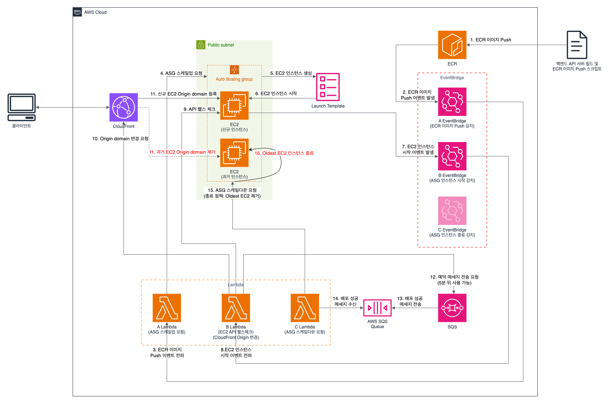

1. `ECR`로 백엔드 API 서버 이미지가 업로드 된다.
2. `A EventBridge`는 `ECR` 이미지 Push 이벤트를 감지한다.
3. `A EventBridge`는 `A Lambda` 함수를 호출한다.
4. `A Lambda`함수는 `ASG`의 `EC2 인스턴스` 사이즈를 1에서 2로 변경한다.
5. `ASG`는 `LaunchTemplate`으로 `EC2 인스턴스`를 생성한다.
6. `ASG`에 `EC2 인스턴스`가 등록되고 `EC2 인스턴스`의 상태가 실행중으로 변경된다.
7. `B EventBridge`는 `ASG`의 `EC2 인스턴스` 실행 성공 이벤트를 감지한다.
8. `B EventBridge`는 `B Lambda` 함수를 호출한다.
9. `B Lambda` 함수는 `신규 EC2 인스턴스`의 HTTP API 헬스 체크를 한다.
10. `B Lambda` 함수는 `CloudFront`에게 Origin domain 업데이트를 요청한다.
11. `CloudFront`는 Origin domain 을 `과거 EC2 인스턴스`에서 `신규 EC2 인스턴스`로 업데이트 한다.
12. `B Lambda` 함수는 `SQS`로 5분 후에 사용 가능한 '배포완료요청' 예약 메시지를 전송한다.
13. (5분 후) `SQS`는 `Queue`에 '배포완료요청' 메시지를 전송한다.
14. `C Lambda` 함수는 `SQS Queue` 에서 '배포완료요청' 메시지를 수신한다.
15. `C Lambda` 함수는 `ASG` 의 `EC2 인스턴스` 사이즈를 2에서 1로 변경한다.
16. `ASG` 는 'Oldest EC2 제거 정책'으로 `과거 EC2 인스턴스`를 종료하고 제거한다.

### 롤벡 구성도

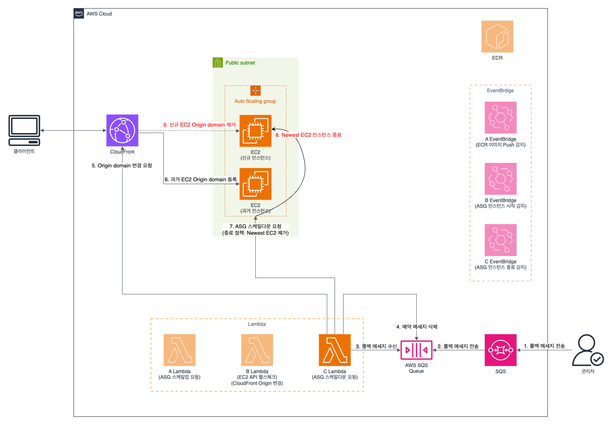

1. `관리자`는 `SQS`로 '롤벡요청' 메시지를 전송한다.
2. `SQS`는 `Queue`로 '롤벡요청' 메시지를 전송한다.
3. `C Lambda` 함수는 `SQS Queue` 에서 '롤벡요청' 메시지를 수신한다.
4. `C Lambda` 함수는 `SQS Queue` 에게 예약 메시지('배포완료요청' 메시지) 삭제 요청을 한다.
5. `C Lambda` 함수는 `CloudFront` 에게 Origin domain 업데이트를 요청한다.
6. `CloudFront` 는 Origin domain 을 `신규 EC2 인스턴스`에서 `과거 EC2 인스턴스`로 업데이트 한다.
7. `C Lambda` 함수는 `ASG`의 `EC2 인스턴스` 사이즈를 2에서 1로 변경한다.
8. `ASG`는 'Newest EC2 제거 정책'으로 `신규 EC2 인스턴스`를 종료하고 제거한다.

### [예외처리] SQS 비용 최적화

아래와 같이 `SQS`의 Lambda 트리거를 동적으로 등록/해제하여 빈 메시지 수신 비용을 절감한다.  
`SQS` 메시지 수신 요청 단위로 사용 금액을 청구하고, 빈 메시지를 수신해도 비용이 청구된다.  
(
참고: https://repost.aws/ko/knowledge-center/sqs-high-charges)  
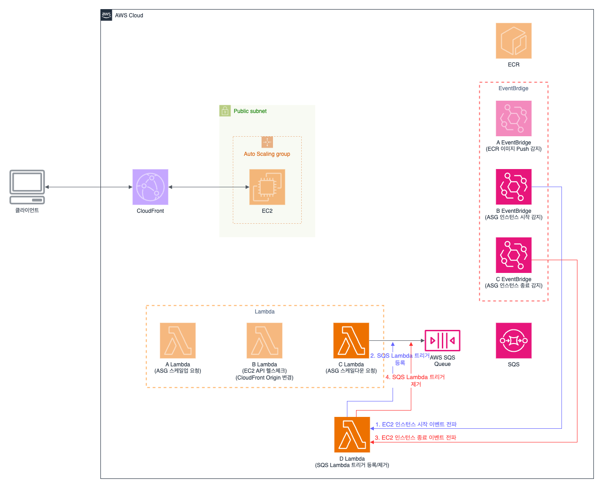

1. `B EventBridge`는 `ASG` 의 `EC2 인스턴스` 실행 성공 이벤트를 감지하고, `D Lambda` 함수를 호출한다.
2. `D Lambda` 함수는 `SQS` 의 Lambda 트리거로 `C Lambda` 함수를 등록한다.
3. `C EventBridge`는 `ASG` 의 `EC2 인스턴스` 종료 성공 이벤트를 감지하고, `D Lambda` 함수를 호출한다.
4. `D Lambda` 함수는 `SQS` 의 Lambda 트리거를 제거한다.

---

# 폴더 설명

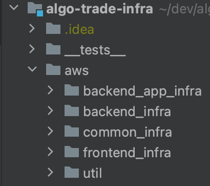

## \_\_tests__

테스트 파일을 선언한다.

## aws/backend_app_infra

백엔드 운영 환경(테스트, 프로덕션)별로 사용하는 AWS 리소스를 선언한다.  
예) `CloudFront`, `ECR`, `ParameterStore`, `SecurityGroup` 등

## aws/backend_infra

백엔드 운영 환경에서 공통으로 사용하는 AWS 리소스를 선언한다.  
예) `RDS`, `ASG`, `EventBridge`, `SQS`, `Lambda` 등

## aws/common_infra

전역적(싱글톤)으로 사용하는 AWS 리소스를 선언한다.  
예) `VPC`, `IAM`, `Lambda Layer` 등

## aws/frontend_infra

프론트엔드 운영 환경별로 사용하는 AWS 리소스를 선언한다.  
예) `CloudFront`, `Lambda`, `S3`, `SNS`, `ParameterStore` 등

## aws/util

AWS 리소스 생성에 도움을 주는 클래스(또는 함수)를 선언한다.  
예) `AwsConfig.ts`(설정파일), `SubnetCidrBlockCalculator.ts`(CIDR 블록 계산) 등

# 네이밍 컨벤션

## 폴더 이름

단수형을 사용하고 snake case 로 짓는다  
예) `cloud_front`, `iam/access_management` 등

## 단일 export 클래스 파일 이름

단수형을 사용하고 pascal case 로 짓는다. export default 로 내보낸다.  
예) `DistributionInfo.ts`, `FrontendRollbackModel.mjs` 등

## 그 외 파일 이름

단수형을 사용하고 camel case 로 짓는다. 복수 개의 함수(또는 클래스)를 export 하는 경우 복수형으로 짓는다.  
예) `generateRedirectUrl.mjs`, `consts.ts`, `utils.ts` 등

# 코딩 컨벤션

## `aws/xxx_infra`의 하위 폴더 이름과 클래스 이름은 AWS Console 의 영문 메뉴명을 참고해서 짓는다.

- 설명:
    - pulumi 로 생성한 AWS 리소스 반영 여부를 쉽게 확인하기 위해서, AWS Console 영문 사이트의 메뉴와 일대일로 매핑되게 폴더를 구성한다.
    - AWS Console 영문 사이트의 1차, 2차 메뉴 이름으로 폴더 이름을 짓고, 3차 메뉴 이름으로 클래스 이름을 짓는다.  
      (예: `CloudFront`(1차 메뉴) -> `Security`(2차 메뉴) ->`Origin access`(3차 메뉴))
    - 2차 메뉴가 없는 경우 폴더 이름으로 `default` 를 사용한다.
    - 복수형을 단수형으로 변경해서 사용한다.
    - 클래스 이름의 접미사 패턴은 [다음 챕터](#awsxxx_infra의-클래스는-트리-구조로-선언한다)에서 설명한다.

- 예시:
    - 폴더 이름
        - 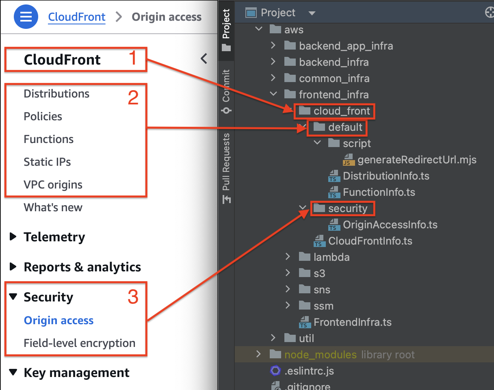
        - 1번: 1차 메뉴명: `CloudFront` -> `cloud_front`
        - 2번: 2차 메뉴명(기본): ` ` -> `default`
        - 3번: 2차 메뉴명: `Security` -> `security`
    - 파일 이름
        - 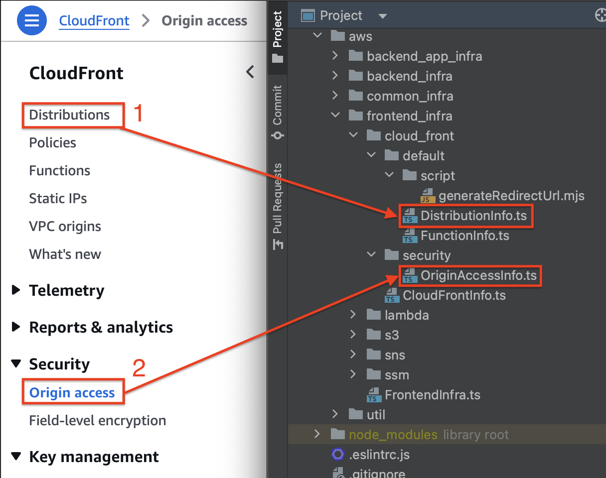
        - 1번: 3차 메뉴명: `Distributions` -> `DistributionInfo.ts`(단수형)
        - 2번: 3차 메뉴명: `Origin access` -> `OriginAccessInfo.ts`

## `aws/xxx_infra`의 클래스는 트리 구조로 선언한다.

- 설명:
    - 루트 노드 클래스는 이름에 접미사 `Infra` 를 사용하고, 그 외 노드 클래스는 이름에 접미사 `Info` 를 사용한다.
    - 상위 노드 생성자에서 하위 노드를 생성하고, 말단 노드는 생산자에서 AWS 리소스를 생성한다.
    - [예외] AWS 리소스 생성 순서에 대한 의존성이 있는 경우 setter 메서드를 제공한다. (예: S3 Bucket 생성 -> CloudFront Distribution 생성 -> S3 Bucket
      Policy 생성)
- 예시
    - 루트 노드 (파일 경로: `aws/frontend_infra/FrontendInfra.ts`)
      ```typescript
      export default class FrontendInfra {
        constructor(appEnv: AppEnv, commonInfra: CommonInfra) {
          // 하위 노드 생성
          const cloudFrontInfo = new CloudFrontInfo(appEnv, s3Info);
          ...
        }
      }
      ```
    - 중간 노드 (파일 경로: `aws/frontend_infra/cloud_front/CloudFrontInfo.ts`)
      ```typescript
      export default class CloudFrontInfo {
        constructor(appEnv: AppEnv, httpPort: number) {
          // 하위 노드 생성
          this.distributionInfo = new DistributionInfo(appEnv, httpPort);
          ...
        }
      }
      ```
    - 말단 노드 (파일 경로: `aws/frontend_infra/cloud_front/default/DistributionInfo.ts`)
      ```typescript
      export default class DistributionInfo {
        constructor(...) {
          // AWS 리소스 생성
          this.distribution = this.createFrontendDistribution(...);
          ...
        }
      }
      ```

## 다른 객체의 참조가 필요한 경우, 말단 노드에서는 private readonly 필드와 헬퍼 메서드를 제공하고, 그 외 노드는 public readonly 필드를 선언한다.

- 설명:
    - 캡슐화를 포기하는 대신 중간 노드의 불필요한 위임 메서드를 제거한다.
    - 참조가 불필요한 경우 필드를 선언하지 않는다.
- 예시
    - 참조 사용 코드 (파일 경로: `frontend_infra/sns/default/SubscriptionInfo.ts`)
      ```typescript
      export default class SubscriptionInfo {
        constructor(appEnv: AppEnv, topicInfo: TopicInfo, lambdaInfo: LambdaInfo) {
          this.createFrontendRollbackTopicSubscription(appEnv, topicInfo, lambdaInfo); // 외부 참조를 제공하지 않기 때문에 AWS 리소스만 생성하고, 필드에 저장하지 않는다.
        }
  
        private createFrontendRollbackTopicSubscription(
            appEnv: AppEnv,
            topicInfo: TopicInfo,
            lambdaInfo: LambdaInfo,
          ) {
            new aws.lambda.Permission(genName(prefix, "lambda-permission"), {
              statementId: "AllowExecutionFromSNS",
              action: "lambda:InvokeFunction",
              principal: "sns.amazonaws.com",
              sourceArn: topicInfo.getCodeDeliveryStateTopicArn(),
              function: lambdaInfo.functionInfo.getFrontendDeliveryFunctionArn(), // 헬퍼 메서드 사용
            });
            ...
          }
        }
      ``` 
    - 참조 제공 중간 노드 (파일 경로: `frontend_infra/lambda/LambdaInfo.ts`)
      ```typescript
      export default class LambdaInfo {
        // public 필드 선언
        public readonly functionInfo: FunctionInfo;
  
        constructor(...) {
          this.functionInfo = new FunctionInfo(appEnv, commonInfra);
          ...
        }
      }
      ```
    - 참조 제공 말단 노드 (파일 경로: `frontend_infra/lambda/default/FunctionInfo.ts`)
        ```typescript
        export default class FunctionInfo extends AwsConfig {
          // private 필드 선언
          private readonly frontendDeliveryFunction: aws.lambda.Function;
  
          constructor(...) {
            this.frontendDeliveryFunction = this.createFrontendDeliveryFunction(commonInfra);
          }
  
          // 헬퍼 메서드 제공
          public getFrontendDeliveryFunctionArn() {
            return this.frontendDeliveryFunction.arn;
          }
        ```

## 최하위 노드에서만 `CommonInfra`의 필드와 메서드를 사용한다. 중간 노드는 `CommonInfra` 객체를 바이패스한다.

- 설명:
    - `common_infra` 폴더와 `다른 infra` 폴더 간에 같은 이름의 클래스가 있을 수 있다. (
      예: `common_infra/lambda/LambdaInfo.ts`, `frontend_infra/lambda/LambdaInfo.ts`)
    - 단순한 import 문을 사용을 위해서 중간 노드는 `CommonInfra` 객체를 그대로 전달하고, 말단 노드에서 `CommonInfra` 객체의 필드와 메서드를 사용한다.
- 예시:
    - 사용자 코드 (파일 경로: `index.ts`)
      ```typescript
      const commonInfra = new CommonInfra();
      new FrontendInfra("test", commonInfra); // commonInfra 전달 시작
      ...
      ```
    - 루트 노드 (파일 경로: `aws/frontend_infra/FrontendInfra.ts`)
      ```typescript
      export default class FrontendInfra {
        constructor(appEnv: AppEnv, commonInfra: CommonInfra) {
          const lambdaInfo = new LambdaInfo(appEnv, commonInfra, s3Info); // commonInfra 전달
          ...
        }
      }
      ```
    - 중간 노드 (파일 경로: `aws/frontend_infra/lambda/LambdaInfo.ts`)
      ```typescript
      export default class LambdaInfo {
        constructor(appEnv: AppEnv, commonInfra: CommonInfra, s3Info: S3Info) {
          this.functionInfo = new FunctionInfo(appEnv, commonInfra); // commonInfra 전달
          ...
        }
      }
      ```
    - 말단 노드 (파일 경로: `aws/frontend_infra/lambda/default/FunctionInfo.ts`)
      ```typescript
      export default class FunctionInfo extends AwsConfig {
        constructor(appEnv: AppEnv, commonInfra: CommonInfra) {
          this.frontendDeliveryFunction = this.createFrontendDeliveryFunction(commonInfra);
          ...
        }
        
        private createFrontendDeliveryFunction(commonInfra: CommonInfra) {
          return new aws.lambda.Function(genName(name, "lambda"), {
            name,
            runtime: aws.lambda.Runtime.NodeJS20dX,
            role: commonInfra.iamInfo.roleInfo.getFrontendDeliveryLambdaRole(), // commonInfra 사용
            layers: [commonInfra.lambdaInfo.layerInfo.getAwsSdkHelperLayerArn()], // commonInfra 사용
            ...
          });
        }
      }
      ```

---

# AWS 주의사항

## CloudFront 와 S3 를 사용한 정적 웹사이트(React 앱) 배포 시, CloudFront Function 으로 리다이렉션 로직을 추가해야 한다

CloudFront 와 S3를 사용한 정적 웹사이트에 사용자가 URL을 직접 입력해서 방문하는 경우 403 에러가 발생한다.  
(오류 페이지를 적용하면 403 에러 발생 시, 홈화면으로 리다이렉션 할 수 있지만 사용자가 원하는 페이지로 리다이렉션할 수 없다)

CloudFront 의 Function 을 사용해서 아래와 같은 로직을 적용하면, 사용자가 입력한 URL 로 페이지를 리다이렉션할 수 있다.

1. `static 폴더의 하위 파일(/static/*)`과 `루트 폴더의 파일(/*.*)`은 bypass 로 리턴한다.
2. 그 외의 URL은 CloudFront 의 Function 으로 리다이렉트 URL 을 생성하고 302 상태 값을 리턴한다.
    1. 리다이렉트 URL 형식: 루트 경로에 쿼리스트링(redirect_path)을 붙여서 생성한다.
    2. 리다이렉트 URL 예시:
        1. 첫 진입 URL: `https://xxx.cloudfront.net/product/1234?name=john&group_ids=1&group_ids=2`
        2. 리다이렉트
           URL: `https://xxx.cloudfront.net/?redirect_path={Base64 인코딩("/product/1234?name=john&group_ids=1&group_ids=2")}`
3. 프론트엔드 코드에서 `redirect_path` 쿼리스트링이 있는 경우 페이지를 라우팅 처리를 한다.

## ECR 과거 이미지 자동으로 삭제하기

ECR 의 Lifecycle Policy 를 사용하면 최대 이미지 개수를 기준으로 과거 이미지를 자동으로 제거할 수 있지만, 이미지 PUSH 이벤트에 실시간으로 실행되지 않고, 최대 24시간 이내에 실행된다.

차선책으로 Amazon EventBridge 와 Lambda 를 사용해서 ECR 과거 이미지를 자동으로 삭제하는 로직으로 사용한다.

[BaseAwsInfo#isFastCleanupEcrImage](https://github.com/newy2/algo-trade-infra/blob/e05c7664abae851fd2aea8e63d1a726b235eba27/aws/BaseAwsInfo.ts#L50-L52)
플래그로 ECR 과거 이미지 자동으로 삭제하는 전략을 선택할 수 있다.

#### 참조 링크:

- [Amazon ECR의 수명 주기 정책을 사용하여 이미지 정리 자동화](https://docs.aws.amazon.com/ko_kr/AmazonECR/latest/userguide/LifecyclePolicies.html)
- [ECR Lifecycle policy not executing](https://repost.aws/questions/QUW-16BgYnSLC6jTHt2QjcmQ/ecr-lifecycle-policy-not-executing)

## Bastion Host 없이 Private RDS 에 접속하기 (ECI Endpoint 사용)

EIC Endpoint 를 사용하면 추가 비용 없이 개발 PC 에서 Private RDS 에 접속할 수 있다.

(참고) 2024년 11월 24일 기준으로 RDS Port 값이 3389 인 경우에만 사용 가능하다.

해당 프로젝트에서는 아래 명령어로 ECI Endpoint 를 사용한다.

```bash
aws ec2-instance-connect open-tunnel --instance-connect-endpoint-id $(aws ssm get-parameter --name "/vpc/eice/rds-connect/id" --query "Parameter.Value" --output text) --private-ip-address $(nslookup $(aws ssm get-parameter --name "/rds/address" --query "Parameter.Value" --output text) | grep "Address" | tail -n 1 | awk '{print $2}') --local-port 3389 --remote-port 3389
```

#### 참조 링크:

- [(LV.200)Amazon RDS 인증과 접속 (feat.Bastion 없이 Private RDS 접속 방법)](https://www.youtube.com/watch?v=Ft-rW0hJVqU&t=0s)
- [EC2 Instance Connect Endpoint를 이용해 Amazon EC2및 Amazon RDS 인스턴스에 안전하게 접속하기
  ](https://aws.amazon.com/ko/blogs/tech/ec2-instance-connect-endpoint-bastion/)

---

# Pulumi 주의사항

## AWS CloudFront Distribution 생성 시, retainOnDelete 옵션을 true 로 설정하면 연관된 resource 가 제대로 삭제되지 않는다

Distribution 는 삭제까지 시간이 오래 걸린다. retainOnDelete 옵션 값을 true 로 설정하고 `pulumi down` 명령어를 호출하면 실제 삭제되기까지 기다리지 않는다.

위 옵션을 적용하면, OriginAccessControl 같은 Distribution 와 연관된 리소스 제대로 삭제되지 않는 현상이 발생한다.

추후, deleteWithMe 같은 옵션을 테스트할 예정이다. 